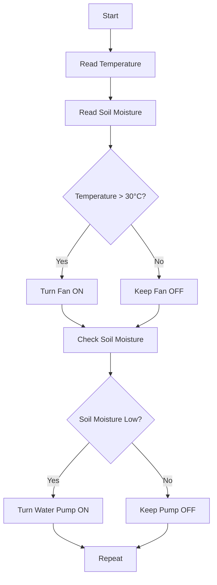

# ***Greenhouse Climate Control System***

# Project Overview 
The Greenhouse Climate Control System is an embedded system that helps maintain suitable conditions for plants inside a greenhouse.

# The system monitors:
#Soil moisture
#Ambient temperature
Based on the sensor readings, the system can automatically control:
#Water pump
#Fan
#Heater
The user can also control the system manually and change the required parameters using a keypad and LCD.

# Main Features 

1. Climate Monitoring
The system reads the soil moisture and ambient temperature using sensors.
The sensor values are displayed on the LCD.

2. Auto / Manual Mode
The system has two modes:

Auto Mode: The system controls the pump, fan, and heater automatically according to the sensor values.
Manual Mode: The user can control the actuators manually.

3. Actuator Control
The system controls three main actuators:
#Water Pump: Used when the soil needs more water.
#Fan: Used when the temperature is too high.
#Heater: Used when the temperature is too low.

4. Warning Indicators
The system provides warnings when the temperature or soil moisture reaches an unwanted level.

5. Parameter Configuration
The user can use the keypad to change the required parameters.
The LCD is used to display the parameters and system status.

# Embedded Concepts Used 

## ADC 
ADC is used to read the analog values from the sensors, such as soil moisture and temperature.

## DIO 
DIO is used to control digital devices, especially the relays connected to the pump, fan, and heater.

## LCD 
The LCD provides information to the user, including:
#Current temperature
#Soil moisture level
#Current operating mode
#Actuator status
#Warnings
#parameters

## Keypad 
The keypad provides the user interface for:
#Selecting Auto/Manual mode
#Change parameters
#Controlling actuators in Manual mode

## State Machine
The system is organized using different states to control its operation.
Example states:
#### INIT
#### AUTO_MODE
#### MANUAL_MODE
#### CONFIGURATION
#### WARNING

## Timers 
Timers are used to control the timing of different operations and to periodically check the sensor values.

# Basic System Flow 

# Main Components 

### Microcontroller
### Soil Moisture Sensor
### Temperature Sensor
### Water Pump
### Fan
### Heater
### Relays
### LCD
### Keypad
### Warning Indicators

# Project Goal
The goal of this project is to build a simple automated greenhouse system that monitors the environment and controls the actuators to help maintain suitable growing conditions.

# Team 4 
### Sama mohamed mahmoud 
### Aseel muhammed elsayed 
### Khaled mohamed ahmed
### Mohamed sedeek mohamed 
