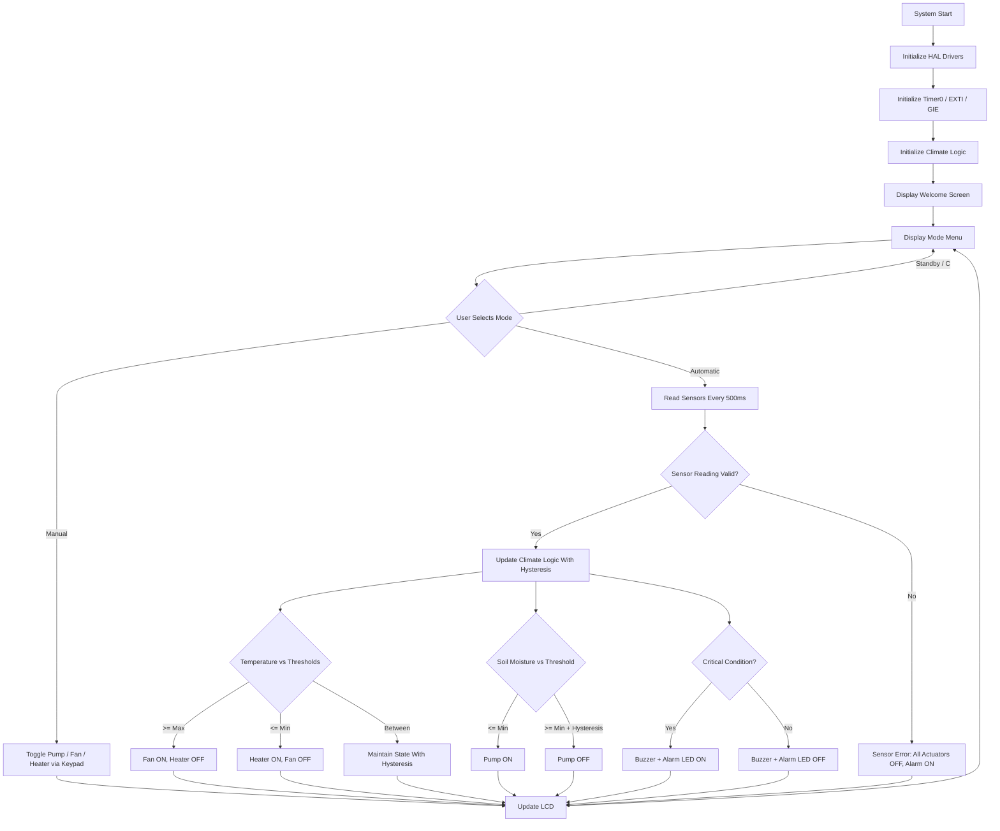

# ***Greenhouse Climate Control System***
 
An embedded **Greenhouse Climate Control System** developed using **C for the AVR ATmega32 microcontroller**. The system monitors temperature and soil moisture and automatically controls a fan, heater, and water pump to maintain suitable greenhouse conditions.
 
It also provides a **Manual Mode** that lets the user directly switch the fan, heater, and pump on/off through the keypad, and an **Automatic Mode** with configurable temperature and moisture thresholds, all shown on an LCD.
 
---
 
## Project Overview
 
The system continuously monitors:
 
- Ambient temperature
- Soil moisture
Based on the sensor readings and the selected mode, the system controls:
 
- Fan
- Heater
- Water pump
The system supports two main operating modes, plus Standby:
 
### Automatic Mode
The system automatically controls the actuators according to configurable temperature and moisture thresholds, using hysteresis to avoid rapid switching.
 
### Manual Mode
The user directly turns the pump, fan, and heater ON/OFF using the keypad. The fan and heater are mutually exclusive — turning one ON automatically turns the other OFF. The automatic control logic is not applied while in Manual Mode.
 
### Standby Mode
All actuators and the alarm are switched off. Sensors are not used to drive any actuator while in Standby.
 
The threshold-configuration screen (Config Menu) is reachable from either the Manual or the Automatic screen and always edits the **Automatic Mode thresholds** (it does not define separate "manual targets").
 
---
 
## Main Features
 
### Climate Monitoring
The system reads temperature and soil-moisture values using sensors connected to the ATmega32 ADC. The current readings are shown on the LCD while in Automatic Mode.
 
### Automatic Mode
 
In Automatic Mode, the system uses configurable thresholds (defaults shown below):
 
| Condition | Action |
|---|---|
| Temperature ≥ Max Temperature (default 40°C) | Fan ON |
| Temperature ≤ Min Temperature (default 18°C) | Heater ON |
| Moisture ≤ Min Moisture (default 35%) | Pump ON |
| Moisture ≥ Min Moisture + 5% (default 40%) | Pump OFF |
 
The system uses **hysteresis** to prevent the actuators from rapidly switching ON and OFF around threshold values:
 
- Temperature hysteresis: **2°C**
- Moisture hysteresis: **5%**
For example, with default thresholds:
 
```text
Fan ON  → Temperature ≥ 40°C
Fan OFF → Temperature ≤ 38°C   (40°C - 2°C hysteresis)
 
Heater ON  → Temperature ≤ 18°C
Heater OFF → Temperature ≥ 20°C   (18°C + 2°C hysteresis)
 
Pump ON  → Moisture ≤ 35%
Pump OFF → Moisture ≥ 40%   (35% + 5% hysteresis)
```
 
#### Configurable Automatic Thresholds
 
From the Config Menu the user can set:
 
- Minimum Temperature (heater ON threshold)
- Maximum Temperature (fan ON threshold)
- Minimum Moisture (pump ON threshold)
Allowed configuration ranges:
 
- Temperature (min and max): **10°C – 50°C**, with the maximum required to be at least 2°C above the minimum
- Minimum Moisture: **10% – 90%**
There is no separate "maximum moisture" setting — the pump-OFF point is always the configured minimum moisture plus the fixed 5% hysteresis.
 
Invalid values (out of range, or max temperature not at least 2°C above min temperature) are rejected and the previous thresholds are kept; the LCD shows an "Invalid Value" screen.
 
### Manual Mode
 
In Manual Mode the user directly toggles each actuator with the keypad:
 
| Key | Action |
|---|---|
| `1` | Toggle Pump ON/OFF |
| `2` | Toggle Fan ON/OFF |
| `3` | Toggle Heater ON/OFF |
| `=` | Open threshold Config Menu |
| `C` | Return to Standby |
 
Safety interlock: turning the **fan** ON while the heater is running switches the heater OFF, and turning the **heater** ON while the fan is running switches the fan OFF. Fan and heater are never allowed to run at the same time.
 
Manual actuator commands are only accepted while the system is in Manual Mode.
 
### Critical Conditions
 
A buzzer (and an alarm LED) is activated when critical environmental conditions are detected:
 
- Temperature ≥ **50°C**
- Temperature ≤ **10°C**
- Soil moisture ≤ **10%**
The system also detects sensor errors: if either the temperature or soil-moisture reading exceeds the valid sensor range (>100), the system enters a **Sensor Error** state, all actuators are switched off, and the alarm is turned on.
 
### Hardware Mode Button
 
In addition to the keypad, a physical push-button on **PD2** (external interrupt INT0) toggles the system directly between **Manual** and **Automatic** mode, with software debouncing (200 ms). The interrupt handler only raises a flag; the mode switch itself is processed in the main loop, not inside the ISR.
 
### LCD Interface
 
The LCD displays information such as:
 
- Current temperature and moisture (Automatic screen)
- Current actuator states — Pump / Fan / Heater (Manual screen)
- Operating mode and climate status
- Configured thresholds during editing
- Warnings (e.g. invalid configuration input)
### Keypad Interface
 
The keypad is used to:
 
- Select Manual Mode, Automatic Mode, or return to Standby
- Toggle actuators directly (Manual Mode)
- Open the threshold Config Menu and edit Min/Max Temperature and Min Moisture
- Enter numeric values (two digits) and confirm with `=`
---
 
## System States
 
The application uses several climate states:
 
```text
CLIMATE_OK
CLIMATE_HIGH_TEMP
CLIMATE_LOW_TEMP
CLIMATE_LOW_MOISTURE
CLIMATE_CRITICAL_EMERGENCY
CLIMATE_SENSOR_ERROR
```
 
The operating modes are:
 
```text
MODE_STANDBY
MODE_MANUAL
MODE_AUTOMATIC
```
 
---
 
## Project Architecture
 
The project follows a layered embedded-system architecture:
 
```text
Greenhouse Climate Control System
│
├── APP
│   ├── main.c
│   ├── Climate_Logic.c
│   └── Climate_Logic.h
│
├── HAL
│   ├── BUZZER
│   ├── KEYPAD
│   ├── LCD
│   ├── LED
│   ├── RELAY
│   ├── SOIL_SENSOR
│   └── TEMP_SENSOR
│
├── MCAL
│   ├── ADC
│   ├── DIO
│   ├── EXTI
│   ├── GIE
│   ├── TIMER0
│   └── TIMER1
│
└── Commen
    ├── BIT_MATH.h
    └── DEFINITIONS.h
```
 
### Application Layer — `APP`
 
Contains the main application logic.
 
- `main.c` initializes the drivers, reads keypad and hardware-button input, updates sensors on a periodic tick, refreshes the LCD, and manages the main application loop and screen state machine.
- `Climate_Logic.c` contains the climate-control logic, actuator control, system states, thresholds, and alarm handling.
### Hardware Abstraction Layer — `HAL`
 
Provides drivers for hardware components:
 
- LCD
- Keypad
- Relay
- Buzzer
- LED
- Temperature sensor
- Soil-moisture sensor
### Microcontroller Abstraction Layer — `MCAL`
 
Contains low-level ATmega32 drivers:
 
- ADC
- Digital I/O
- External Interrupt (EXTI / INT0) — used for the hardware mode button
- Global Interrupt Enable
- Timer0 — provides the millisecond system tick actually used by the application
- Timer1 — a general-purpose timer driver present in the codebase but not currently used by the application logic
### Common Layer
 
Contains shared definitions and bit-manipulation macros.
 
---
 
## Hardware Components
 
The system is designed around the following components:
 
- **ATmega32 Microcontroller**
- Temperature Sensor
- Soil Moisture Sensor
- LCD
- Keypad
- Hardware mode button (PD2 / INT0)
- Relay Module (Pump → PD3, Fan → PD4, Heater → PD5, active-high)
- Water Pump
- Fan
- Heater
- Buzzer
- Alarm LED
---
 
## Embedded Concepts Used
 
### ADC — Analog-to-Digital Converter
 
The ADC is used to read analog sensor values, including:
 
- Temperature
- Soil moisture
### DIO — Digital Input/Output
 
DIO is used for controlling and communicating with digital hardware components, including the relay outputs and the mode-button input pin.
 
### EXTI — External Interrupt
 
INT0 on PD2 is used to detect presses of the hardware mode button and trigger a mode toggle between Manual and Automatic.
 
### Timers
 
Timer0 provides a millisecond system tick used for:
 
- Periodic sensor updates (every 500 ms)
- Periodic LCD refresh (every 500 ms)
- Mode-button debounce timing (200 ms)
- The startup welcome-screen delay
Timer1 is implemented as a driver but is not currently wired into the application.
 
### Interrupts
 
Global interrupts are enabled to support the Timer0 tick and the INT0 mode-button interrupt. The mode-button ISR only sets a flag; all LCD and relay operations happen afterward in the main loop, not inside the ISR.
 
### Hysteresis
 
Hysteresis is implemented for temperature and moisture control in Automatic Mode to prevent rapid actuator switching (see the Automatic Mode section above for exact values).
 
---
 
## System Flow
 

 
---
 
## User Interface
 
### Mode Selection (Mode Menu)
 
| Key | Function |
|---|---|
| `1` | Enter Manual Mode |
| `2` | Enter Automatic Mode |
| `C` | Stop / Standby |
 
### Manual Mode Screen
 
| Key | Function |
|---|---|
| `1` | Toggle Pump |
| `2` | Toggle Fan (turns Heater off) |
| `3` | Toggle Heater (turns Fan off) |
| `=` | Open Config Menu |
| `C` | Return to Standby |
 
### Automatic Mode Screen
 
| Key | Function |
|---|---|
| `=` | Open Config Menu |
| `C` | Return to Standby |
 
### Config Menu (Automatic Thresholds)
 
| Key | Function |
|---|---|
| `1` | Edit Minimum Temperature |
| `2` | Edit Maximum Temperature |
| `3` | Edit Minimum Moisture |
| `C` | Back to the previous operating screen |
 
### Editing a Value
 
The user enters up to a two-digit value using `0–9`, then confirms with `=`. Pressing `C` cancels and returns to the Config Menu. An invalid value (out of the allowed range, or breaking the minimum 2°C gap between min/max temperature) shows an "Invalid Value" screen; pressing `C` returns to the Config Menu.
 
---
 
## Safety Features
 
The project includes the following safety mechanisms:
 
### Fan / Heater Interlock
 
The fan and heater can never be commanded ON at the same time, in both Manual and Automatic Mode — enabling one always disables the other first.
 
### Critical Temperature Protection
 
The system activates the buzzer and alarm LED if:
 
```text
Temperature ≥ 50°C
```
 
or
 
```text
Temperature ≤ 10°C
```
 
### Critical Moisture Protection
 
The buzzer and alarm LED are activated when:
 
```text
Soil Moisture ≤ 10%
```
 
### Sensor Error Handling
 
If either the temperature or soil-moisture sensor returns a reading above the valid range, the system enters `CLIMATE_SENSOR_ERROR`, turns off the pump, fan, and heater, and activates the alarm.
 
### Debounced Hardware Button
 
The hardware mode button on PD2 is debounced in software (200 ms) to prevent spurious mode switches.
 
> **Note:** There is currently no maximum-continuous-runtime / cooldown protection for the water pump — the pump is only switched by the Automatic-Mode moisture logic or by direct manual toggling.
 
---
 
## Technologies & Tools
 
| Technology | Usage |
|---|---|
| C | Main programming language |
| C99 | C language standard |
| AVR ATmega32 | Target microcontroller |
| AVR-GCC | Compiler |
| ADC | Analog sensor readings |
| DIO | Digital I/O |
| EXTI (INT0) | Hardware mode-button interrupt |
| Timer0 | System millisecond tick |
| Timer1 | Timer peripheral (driver present, not yet used by the app) |
| LCD | User display |
| Keypad | User input |
| Relays | Actuator control |
| VS Code | Development environment |
| Proteus | Simulation/testing |
 
---
 
## Repository Structure
 
```text
Greenhouse-climate-control-system/
│
├── Src/
│   ├── APP/
│   │   ├── main.c
│   │   ├── Climate_Logic.c
│   │   └── Climate_Logic.h
│   │
│   ├── HAL/
│   │   ├── BUZZER/
│   │   ├── KEYPAD/
│   │   ├── LCD/
│   │   ├── LED/
│   │   ├── RELAY/
│   │   ├── SOIL_SENSOR/
│   │   └── TEMP_SENSOR/
│   │
│   ├── MCAL/
│   │   ├── ADC/
│   │   ├── DIO/
│   │   ├── EXTI/
│   │   ├── GIE/
│   │   ├── TIMER0/
│   │   └── TIMER1/
│   │
│   └── Commen/
│       ├── BIT_MATH.h
│       └── DEFINITIONS.h
│
├── .vscode/
│   └── c_cpp_properties.json
│
├── GreenhouseSystem.hex
├── Greenhouse climate control systemConfig.json
└── README.md
```
 
---
 
## Project Goal
 
The goal of this project is to develop a reliable embedded greenhouse controller capable of monitoring environmental conditions and automatically maintaining suitable conditions for plants, while still allowing direct manual override of every actuator.
 
The system combines:
 
- Sensor monitoring
- Automatic actuator control with hysteresis
- Manual direct actuator control with a fan/heater interlock
- Configurable automatic thresholds
- LCD and keypad interaction, plus a hardware mode button
- Critical-condition and sensor-error alarms
- Timer-based periodic control
- Layered embedded software architecture (APP / HAL / MCAL)
---
 
 
## Team 4
 
- **Sama Mohamed Mahmoud**
- **Aseel Muhammed Elsayed**
- **Khaled Mohamed Ahmed**
- **Mohamed Sedeek Mohamed**

