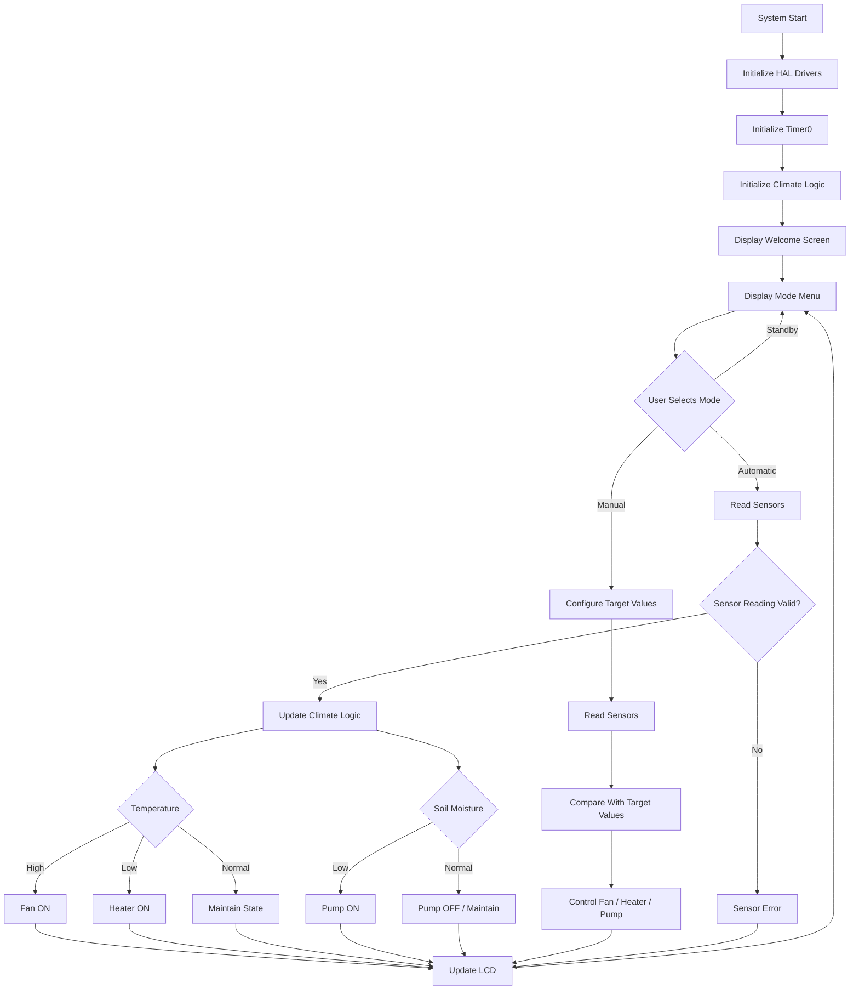

# ***Greenhouse Climate Control System***


An embedded **Greenhouse Climate Control System** developed using **C for the AVR ATmega32 microcontroller**. The system monitors temperature and soil moisture and automatically controls a fan, heater, and water pump to maintain suitable greenhouse conditions.

It also provides a **Manual Mode** that allows the user to configure target temperature and moisture values through a keypad and monitor the system through an LCD.

---

##  Project Overview

The system continuously monitors:

-  Ambient temperature
-  Soil moisture

Based on the sensor readings, the system controls:

-  Fan
-  Heater
-  Water pump

The system supports two main operating modes:

### Automatic Mode
The system automatically controls the actuators according to predefined temperature and moisture thresholds.

### Manual Mode
The user can set desired temperature and soil-moisture targets using the keypad. The system then controls the actuators according to these targets.

A **Standby Mode** is also available when the system is not actively controlling the environment.

---

##  Main Features

###  Climate Monitoring
The system reads temperature and soil-moisture values using sensors connected to the ATmega32 ADC.

The current readings are displayed on the LCD.

###  Automatic Mode

In Automatic Mode, the system uses predefined thresholds:

| Condition | Action |
|---|---|
| Temperature ≥ 40°C | Fan ON |
| Temperature ≤ 18°C | Heater ON |
| Moisture ≤ 35% | Pump ON |
| Moisture ≥ 55% | Pump OFF |

The system uses **hysteresis** to prevent the actuators from rapidly switching ON and OFF around threshold values.

###  Manual Mode

The user can configure:

- Target temperature
- Target soil moisture

Default values:

- Target temperature: **25°C**
- Target moisture: **50%**

Allowed configuration ranges:

- Temperature: **10°C – 50°C**
- Moisture: **10% – 90%**

Manual control also uses tolerance values to provide stable actuator operation.

###  Pump Protection

The water pump has a safety mechanism to prevent excessive continuous operation.

- Maximum continuous operation: **10 seconds**
- Cooldown period: **5 seconds**

After running for the maximum allowed time, the pump is automatically switched OFF and must complete its cooldown period before restarting.

###  Critical Conditions

A buzzer is activated when critical environmental conditions are detected.

Critical conditions include:

- Temperature ≥ **50°C**
- Temperature ≤ **10°C**
- Soil moisture ≤ **10%**

The system also detects sensor errors and reports a **Sensor Error** state.

###  LCD Interface

The LCD displays information such as:

- Current temperature
- Soil moisture
- Operating mode
- Climate status
- Target parameters
- System warnings

###  Keypad Interface

The keypad allows the user to:

- Select Manual Mode
- Select Automatic Mode
- Return to Standby
- Change target temperature
- Change target moisture

---

##  System States

The application uses several climate states:

```text
CLIMATE_OK
CLIMATE_HIGH_TEMP
CLIMATE_LOW_TEMP
CLIMATE_LOW_MOISTURE
CLIMATE_CRITICAL_EMERGENCY
CLIMATE_SENSOR_ERROR
```

The operating modes are:

```text
MODE_STANDBY
MODE_MANUAL
MODE_AUTOMATIC
```

---

##  Project Architecture

The project follows a layered embedded-system architecture:

```text
Greenhouse Climate Control System
│
├── APP
│   ├── main.c
│   ├── Climate_Logic.c
│   └── Climate_Logic.h
│
├── HAL
│   ├── BUZZER
│   ├── KEYPAD
│   ├── LCD
│   ├── LED
│   ├── RELAY
│   ├── SOIL_SENSOR
│   └── TEMP_SENSOR
│
├── MCAL
│   ├── ADC
│   ├── DIO
│   ├── GIE
│   ├── TIMER0
│   └── TIMER1
│
└── Commen
    ├── BIT_MATH.h
    └── DEFINITIONS.h
```

### Application Layer — `APP`

Contains the main application logic.

- `main.c` initializes the drivers, reads user input, updates sensors, and manages the main application loop.
- `Climate_Logic.c` contains the climate-control logic, actuator control, system states, thresholds, alarms, and pump protection.

### Hardware Abstraction Layer — `HAL`

Provides drivers for hardware components:

- LCD
- Keypad
- Relay
- Buzzer
- LED
- Temperature sensor
- Soil-moisture sensor

### Microcontroller Abstraction Layer — `MCAL`

Contains low-level ATmega32 drivers:

- ADC
- Digital I/O
- Global Interrupt Enable
- Timer0
- Timer1

### Common Layer

Contains shared definitions and bit-manipulation macros.

---

##  Hardware Components

The system is designed around the following components:

- **ATmega32 Microcontroller**
- Temperature Sensor
- Soil Moisture Sensor
- LCD
- Keypad
- Relay Module
- Water Pump
- Fan
- Heater
- Buzzer
- LEDs

---

##  Embedded Concepts Used

### ADC — Analog-to-Digital Converter

The ADC is used to read analog sensor values, including:

- Temperature
- Soil moisture

### DIO — Digital Input/Output

DIO is used for controlling and communicating with digital hardware components.

### Timers

Timer0 provides a millisecond system tick used for:

- Periodic sensor updates
- LCD updates
- Pump maximum-run protection
- Pump cooldown timing

### Interrupts

Global interrupts are enabled to support timer-based system operation.

### Hysteresis

Hysteresis is implemented for temperature and moisture control to prevent rapid actuator switching.

For example, the automatic fan uses:

```text
Fan ON  → Temperature ≥ 40°C
Fan OFF → Temperature ≤ 35°C
```

This creates a 5°C hysteresis range.

---

##  System Flow



---

##  User Interface

### Mode Selection

The keypad provides the following basic controls:

| Key | Function |
|---|---|
| `1` | Manual Mode |
| `2` | Automatic Mode |
| `C` | Back / Standby |
| `=` | Confirm input |
| `0–9` | Enter parameter values |

### Manual Configuration

In Manual Mode:

```text
1 → Change Target Temperature
2 → Change Target Moisture
C → Return
```

The user enters a two-digit value using the keypad and presses `=` to confirm.

---

##  Safety Features

The project includes several safety mechanisms:

### Pump Run-Time Protection

The pump cannot operate continuously for more than:

```text
10 seconds
```

After that, it enters a:

```text
5-second cooldown period
```

### Critical Temperature Protection

The system activates the buzzer if:

```text
Temperature ≥ 50°C
```

or

```text
Temperature ≤ 10°C
```

### Critical Moisture Protection

The buzzer is activated when:

```text
Soil Moisture ≤ 10%
```

### Sensor Error Handling

If either the temperature or soil-moisture sensor returns an invalid reading, the system enters:

```text
CLIMATE_SENSOR_ERROR
```

---

##  Technologies & Tools

| Technology | Usage |
|---|---|
| C | Main programming language |
| C99 | C language standard |
| AVR ATmega32 | Target microcontroller |
| AVR-GCC | Compiler |
| ADC | Analog sensor readings |
| DIO | Digital I/O |
| Timer0 | System timing |
| Timer1 | Timer peripheral |
| LCD | User display |
| Keypad | User input |
| Relays | Actuator control |
| VS Code | Development environment |
| Proteus | Simulation/testing |

---

##  Project Configuration

The project is configured for:

```text
Microcontroller : ATmega32
CPU Frequency   : 8 MHz
Language        : C
Standard        : C99
Optimization    : O2
Compiler Flags  : -DF_CPU=8000000UL -Wall -Wextra
Programmer      : USBasp
Interface       : SPI
```

The configuration is stored in:

```text
Greenhouse climate control systemConfig.json
```

---

##  How to Build

### Prerequisites

Install:

- AVR-GCC
- AVR binutils / AVR toolchain
- VS Code
- C/C++ extension for VS Code

Make sure the AVR compiler is available in your system environment.

The project is configured for:

```text
ATmega32
F_CPU = 8000000UL
```

### Include Path

The project uses:

```text
Src
```

as its main include path.

The VS Code configuration is located at:

```text
.vscode/c_cpp_properties.json
```

---

##  Repository Structure

```text
Greenhouse-climate-control-system/
│
├── Src/
│   ├── APP/
│   │   ├── main.c
│   │   ├── Climate_Logic.c
│   │   └── Climate_Logic.h
│   │
│   ├── HAL/
│   │   ├── BUZZER/
│   │   ├── KEYPAD/
│   │   ├── LCD/
│   │   ├── LED/
│   │   ├── RELAY/
│   │   ├── SOIL_SENSOR/
│   │   └── TEMP_SENSOR/
│   │
│   ├── MCAL/
│   │   ├── ADC/
│   │   ├── DIO/
│   │   ├── GIE/
│   │   ├── TIMER0/
│   │   └── TIMER1/
│   │
│   └── Commen/
│       ├── BIT_MATH.h
│       └── DEFINITIONS.h
│
├── .vscode/
│   └── c_cpp_properties.json
│
├── Greenhouse climate control systemConfig.json
└── README.md
```

---

##  Project Goal

The goal of this project is to develop a reliable embedded greenhouse controller capable of monitoring environmental conditions and automatically maintaining suitable conditions for plants.

The system combines:

- Sensor monitoring
- Automatic actuator control
- Manual user configuration
- LCD and keypad interaction
- Safety mechanisms
- Timer-based control
- Embedded software architecture

---

##  Team 4

- **Sama Mohamed Mahmoud**
- **Aseel Muhammed Elsayed**
- **Khaled Mohamed Ahmed**
- **Mohamed Sedeek Mohamed**

---


